САНКТ-ПЕТЕРБУРГСКИЙ ПОЛИТЕХНИЧЕСКИЙ УНИВЕРСИТЕТ

ПЕТРА ВЕЛИКОГО

\______________________________________________________________\_

Институт компьютерных наук и технологий

Высшая школа интеллектуальных систем и суперкомпьютерных технологий

Отчет по лабораторным работам

Дисциплина

«Разработка Android-приложений»

20 вариант.

Выполнил: Самсонов С. И.

Группа: 3530901/80202

Преподаватель: Алексюк А. О.

Санкт-Петербург

2020

>   СОДЕРЖАНИЕ

[1	Список иллюстраций	3](#_Toc51803121)

[2	Задачи	4](#_Toc51803122)

>   [2.1	Задание 1. LinearLayout	4](#_Toc51803123)

>   [2.1.1	Формулировка	4](#_Toc51803124)

>   [2.1.2	Ход работы	4](#_Toc51803125)

>   [2.2	Задание 2. ConstraintLayout	10](#_Toc51803126)

>   [2.2.1	Формулировка	10](#_Toc51803127)

>   [2.2.2	Ход работы	10](#_Toc51803128)

>   [2.3	Задание 3. ConstraintLayout	13](#_Toc51803129)

>   [2.3.1	Формулировка	13](#_Toc51803130)

>   [2.3.2	Ход работы	13](#_Toc51803131)

>   [2.4	Альтернативный способ выполнения задания 2
>   (ConstraintLayout)	15](#_Toc51803132)

>   [2.4.1	Ход работы	15](#_Toc51803133)

[3	Выводы	16](#_Toc51803134)

>   [3.1	LinearLayout (Задача 1)	16](#_Toc51803135)

>   [3.1.1	Наблюдения	16](#_Toc51803136)

>   [3.1.2	Атрибуты	16](#_Toc51803137)

>   [3.2	ConstraintLayout (Задачи 2-3)	16](#_Toc51803138)

>   [3.2.1	Наблюдения	16](#_Toc51803139)

>   [3.2.2	Атрибуты	16](#_Toc51803140)

>   [3.3	Целесообразность использования (LinearLayout vs
>   ConstraintLayout)	16](#_Toc51803141)

>   [3.4	Общее	16](#_Toc51803142)

# Список иллюстраций

[Рисунок 1. Макет экрана для задания	4](#_Toc51803143)

[Рисунок 2. Выбор макета приложения	4](#_Toc51803144)

[Рисунок 3. Настройка рабочего каталога	5](#_Toc51803145)

[Рисунок 4. Конвертация Layout-а по умолчанию	6](#_Toc51803146)

[Рисунок 5. Общий вид размещения	7](#_Toc51803147)

[Рисунок 6. Настройка полей активных элементов	7](#_Toc51803148)

[Рисунок 7. Предупреждения среды	8](#_Toc51803149)

[Рисунок 8.Добавление описаний в файл ресурсов	8](#_Toc51803150)

[Рисунок 9. Предупреждения о вложенных весах	9](#_Toc51803151)

[Рисунок 10. Заготовка под размещение	10](#_Toc51803152)

[Рисунок 11. Формирование цепочек	11](#_Toc51803153)

[Рисунок 12. Привязка элементов между собой	11](#_Toc51803154)

[Рисунок 13. Подгонка размеров элементов	11](#_Toc51803155)

[Рисунок 14. Изменения в файлах ресурсов	12](#_Toc51803156)

[Рисунок 15. Макет экрана	13](#_Toc51803157)

[Рисунок 16. Привязка интерфейса к  GuideLine-ам	13](#_Toc51803158)

[Рисунок 17. Готовый файл разметки	14](#_Toc51803159)

[Рисунок 18. Сетка guideline-ов	15](#_Toc51803160)

[Рисунок 19. Альтернатива ко второму заданию	15](#_Toc51803161)

# Задачи

## Задание 1. LinearLayout

### Формулировка

Создайте layout-ресурсы для макета с использованием LinearLayout.

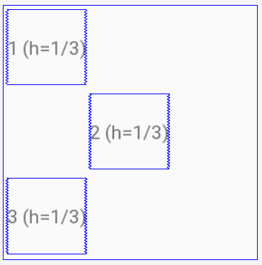

Рисунок 1. Макет экрана для задания

### Ход работы

Создаем новый проект с Empty Activity.

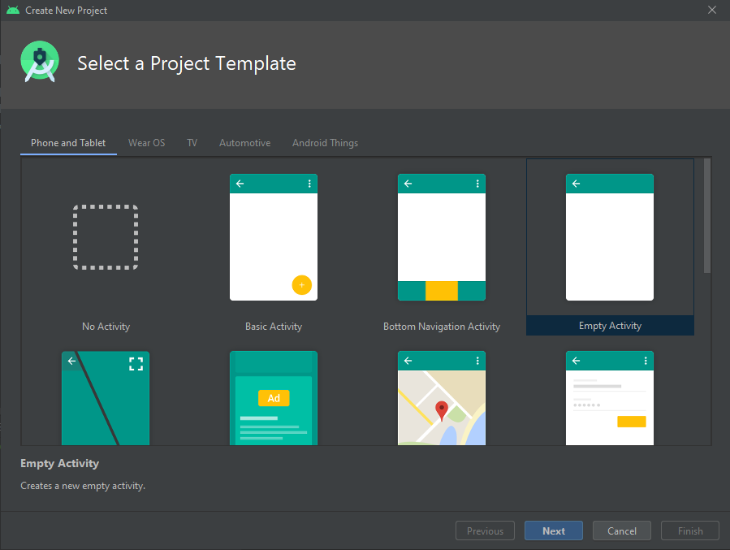

Рисунок 2. Выбор макета приложения

Прописываем пути к рабочим директориям.

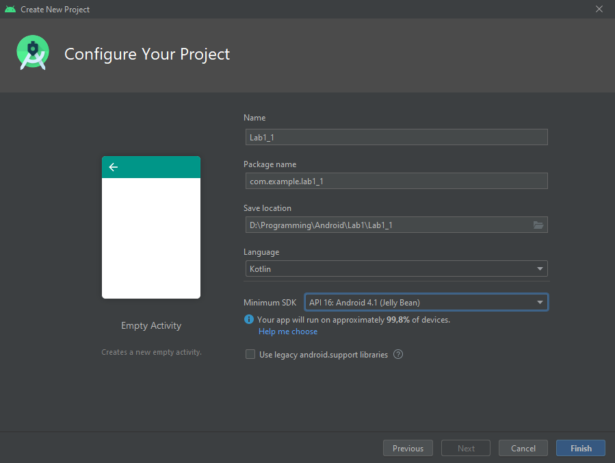

Рисунок 3. Настройка рабочего каталога

Настраиваем графический интерфейс и конвертируем ConstraintLayout (выбран по
умолчанию) в LinearLayout (горизонтальный).

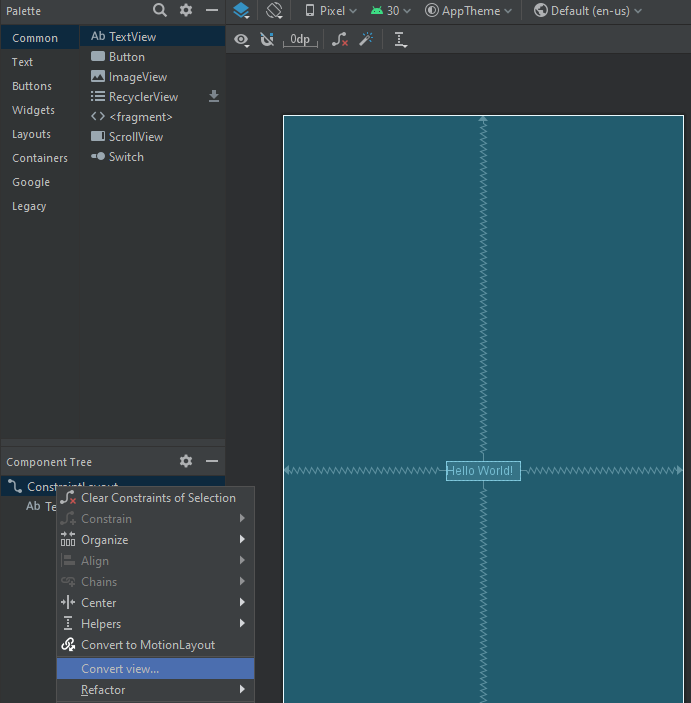

Рисунок 4. Конвертация Layout-а по умолчанию

Сразу же создаем вложенные вертикальные Layout-ы под группу элементов слева, в
оставшейся ячейке размещаем Space. Здесь же настраиваем всем элементам Layout-а
верхнего уровня одинаковые веса (0.3), чтобы распределить их равномерно по
экрану. Добавляем пространство (Space) для создания ячеечной структуры,
настраиваем одинаковые веса (1) и меняем параметры ширины и высоты на одинаковые
для всех элементов.

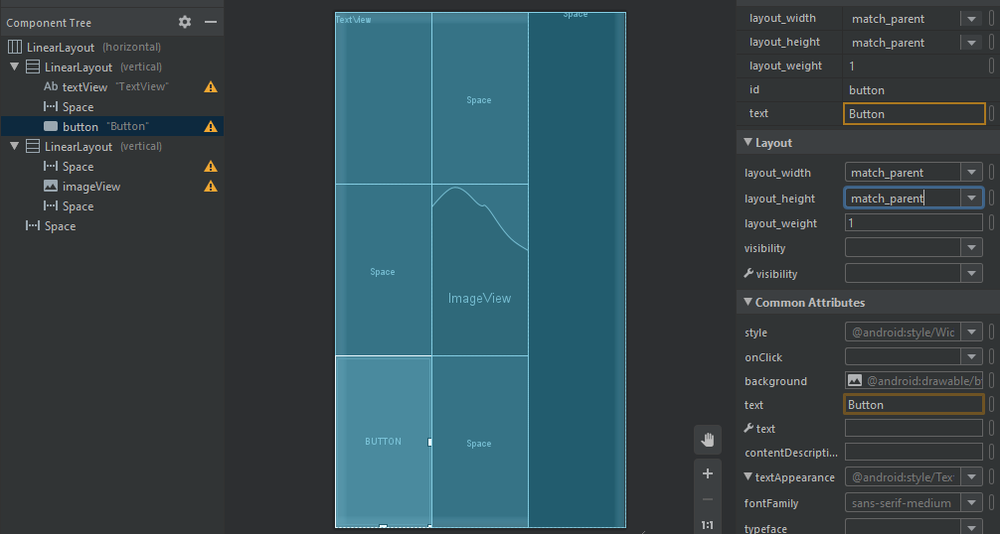

Рисунок 5. Общий вид размещения

Настраиваем отступы для элементов, отключаем видимость Space-ов.

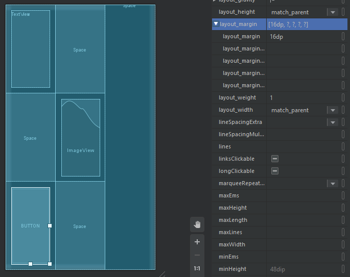

Рисунок 6. Настройка полей активных элементов

Просматриваем предупреждения и пробуем избавиться от некоторых из них.

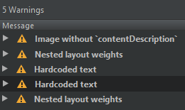

Рисунок 7. Предупреждения среды

Image without \`contentDescription\`, как и Hardcoded text, исправляются
добавлением в ресурсы соответствующих строк (через редактор, например).

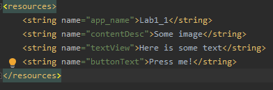

Рисунок 8.Добавление описаний в файл ресурсов

Предупреждение о вложенных весах убрать не удалось: для этого рекомендуется
изменять тип Layout-а   
(в частности на Constraint).

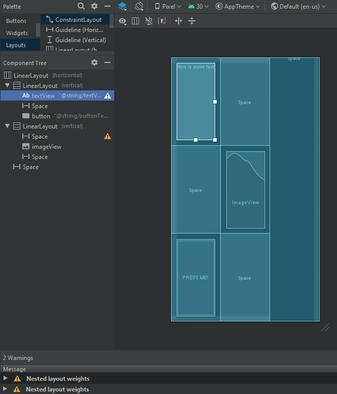

Рисунок 9. Предупреждения о вложенных весах

## Задание 2. ConstraintLayout

### Формулировка

Создайте layout-ресурсы для макета (см. задание 1) с использованием
ConstraintLayout.

### Ход работы

Опустим создание проекта и настройку рабочих директорий, они аналогичны
изложенным в п. 2.1.2.

Тип Layout-а по умолчанию совпадает с указанным в задании. Здесь ничего не
меняем, только раскидываем на экране три различных кнопки и пару Space-ов.

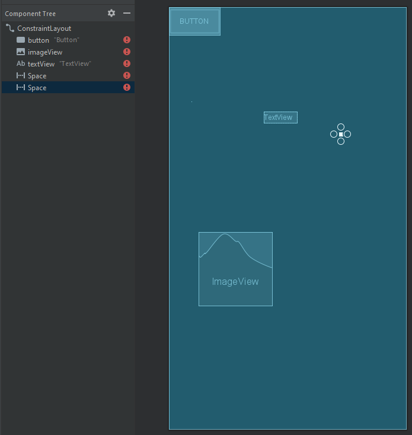

Рисунок 10. Заготовка под размещение

Связываем цепочки элементов (для экономии места дальнейшие изображения приведены
в горизонтальном формате).

**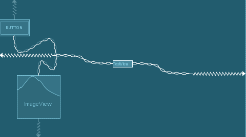**

Рисунок 11. Формирование цепочек

Указываем относительное расположение элементов, добавляем отступы

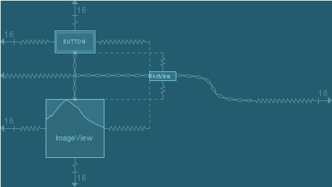

Рисунок 12. Привязка элементов между собой

Переставляем размеры элементов на match constraint, отключаем видимость
Space-ов. Дополняем XML-файл строчкой *tools:ignore=”MissingConstraints”* для
space2.

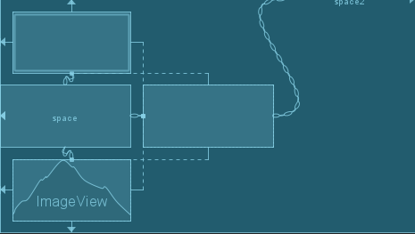

Рисунок 13. Подгонка размеров элементов

Редактируем строки в ресурсах и избавляемся от предупреждений среды.

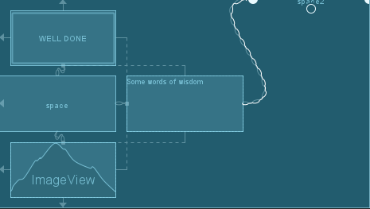

Рисунок 14. Изменения в файлах ресурсов

## Задание 3. ConstraintLayout

### Формулировка

Создайте layout-ресурс для следующего макета с использованием ConstraintLayout.

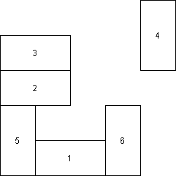

Рисунок 15. Макет экрана

### Ход работы

Создаем проект, делим XML-файл на 25 ячеек с помощью Guideline-ов, затем
начинаем размещать элементы интерфейса в соответствии с заданием.

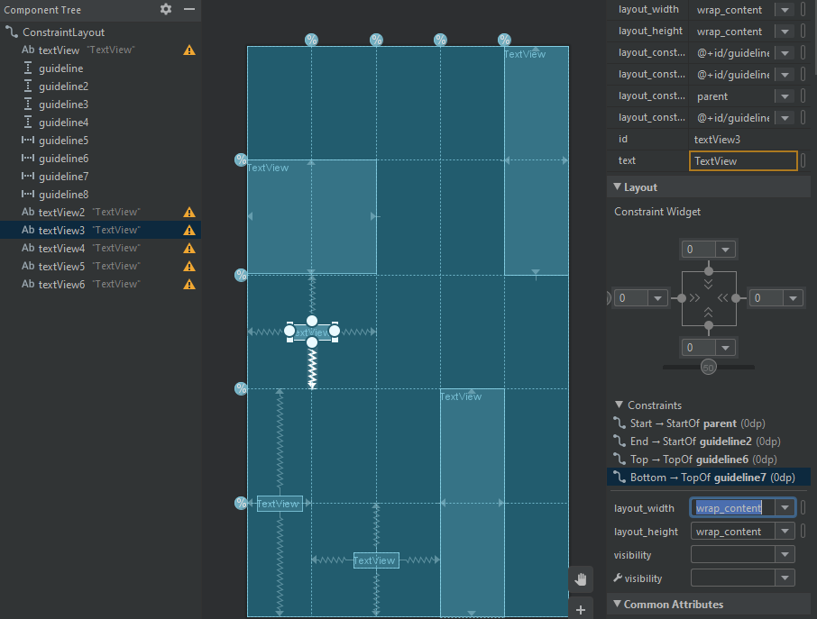

Рисунок 16. Привязка интерфейса к GuideLine-ам

Окончательно доработанная версия имеет следующий вид.

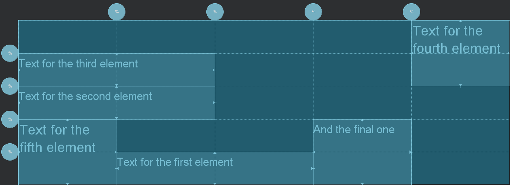

Рисунок 17. Готовый файл разметки

## Альтернативный способ выполнения задания 2 (ConstraintLayout)

### Ход работы

С целью избежать предупреждения среды о «вложенных весах» (nested weights) было
решено использовать guideline-ы для размещения объектов внутри layout-а.

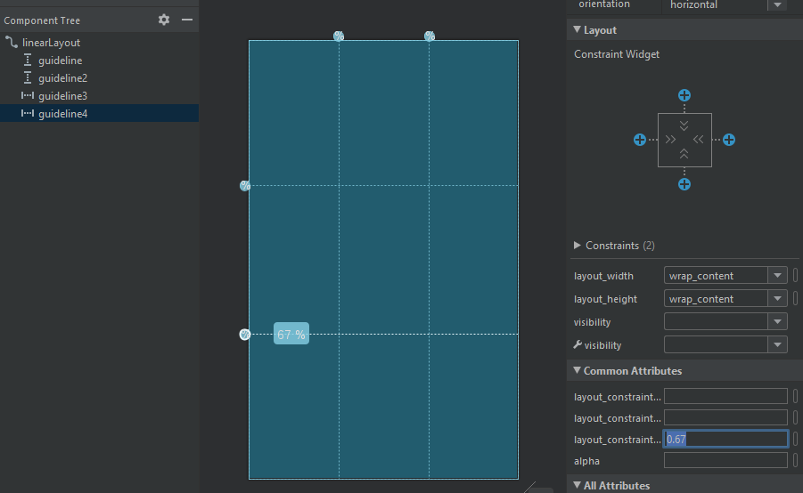

Рисунок 18. Сетка guideline-ов

Окончательный вариант размещения представлен ниже.

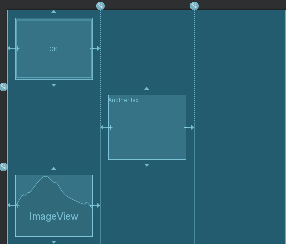

Рисунок 19. Альтернатива ко второму заданию

# Выводы

## LinearLayout (Задача 1)

### Наблюдения

Несмотря на то, что в документации для равномерного распределения элементов в
layout-е рекомендуется выставлять каждому из них значение 1, допустимо
использовать и другие положительные (в том числе десятичные дробные) значения.
Существует предположение, что это отрицательно скажется на производительности.

### Атрибуты

-   **layout\_weight** – веса потомков (каждой ячейки layout-а); используются
    для распределения места между ячейками;

-   **gravity** – вес самого layout-а (например, для использования вложенных
    layout-ов). Аналогичен весам элементов;

-   **layout\_gravity** – определяет особенности позиционирования элемента в его
    группе ячеек.

-   **orientation** – определяет расположение ячеек
    (вертикальное/горизонтальное);

-   **layout_height** – высота layout-a;

-   **layout_width** – ширина layout-a.

## ConstraintLayout (Задачи 2-3)

### Наблюдения

Наблюдения не претендуют на расширение базы из документации. Можно только
отметить, что работу с данным layout-ом удобно вести непосредственно через
графический интерфейс Android Studio.

### Атрибуты

-   **layout\_constraintHorizontal\_weight** – «вес» содержимого в
    горизонтальной плоскости, используется для распределения места между
    элементами layout-a;

-   **layout\_constraintVertical\_weight** – «вес» содержимого в вертикальной
    плоскости.

## Целесообразность использования (LinearLayout vs ConstraintLayout)

На данный момент Google ориентируется на упрощение разработки, что вылилось в
оптимизации “drag&drop”-интерфейса и добавлении **ConstraintLayout**. Также
**ConstraintLayout** рекомендуется использовать для лучшей производительности и
б*о*льшего количества поддерживаемых инструментов.

Тем не менее, **LinearLayout** все еще удобнее применять для создания простых
виджетов. При этом не стоит забывать, что большое количество вложенных
**LinearLayout**-ов при изменении размера родительского окна вынуждены будут
пересчитывать координаты хранимых объектов, что негативно повлияет на скорость
работы приложения (cascade resizing and re-positioning).

## Общее

В ходе лабораторной работы получены начальные навыки работы со средой Android
Studio; изучены основные принципы верстки layout с использованием View и
ViewGroup; изучены основные возможности и свойства LinearLayout и
ConstraintLayout.
